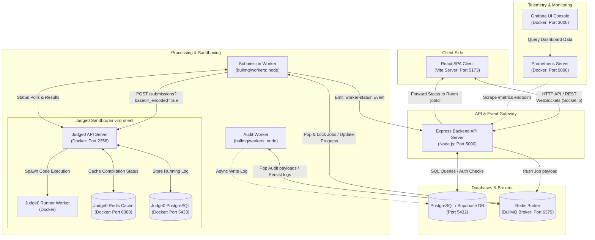
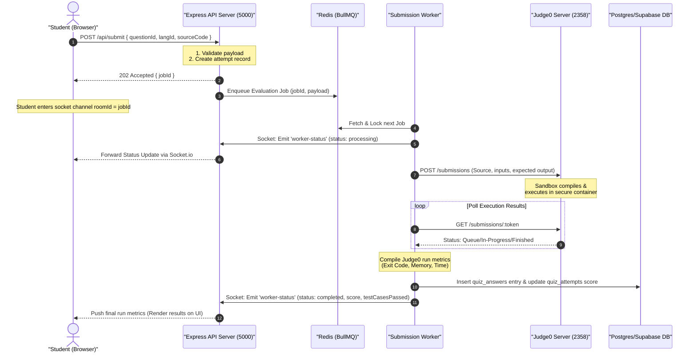

# 🧠 QuizPortal (LeetCode Clone)

[](https://opensource.org/licenses/ISC)
[](https://react.dev/)
[](https://nodejs.org/)
[](https://www.docker.com/)

A modern, high-performance, full-stack assessment platform and coding sandbox. It features automated code evaluation (via **Judge0**), real-time updates (via **Socket.io**), semantic question classification (via **Groq AI**), background processing queues (via **BullMQ/Redis**), and monitoring (via **Prometheus & Grafana**).

---

## 🚀 Key Features

### 👨‍🎓 Student Experience

- **Interactive Code Editor**: Monaco Editor integration with language syntax highlighting and custom themes.
- **Instant Feedback**: Automated execution of test cases with detailed stdout, stderr, runtime, and memory metrics.
- **Gamified Leaderboards**: Real-time ranking updates based on quiz points and solve times.
- **Analytics & History**: Detailed personal performance charts (via Recharts) and detailed submission reviews.

### 👩‍🏫 Teacher Workspace

- **Quiz Builder**: Create custom assessment paths containing MCQs, Descriptive, and Coding questions.
- **AI-Assisted Classification**: Auto-tag question difficulty and CS domains (e.g., Data Structures, Complexity, Logic) using semantic Groq LLM pipelines.
- **Normalized Analytics**: Percentage-based score distributions, topic performance graphs, and difficulty statistics.
- **Manual Evaluations**: Grading portal to review student answers, add feedback, and award marks.

### 🛡️ Admin & System Telemetry

- **Role Control**: Moderate access requests and configure user roles (Student, Teacher, Admin, Master).
- **Audit Logging**: Trace all teacher/admin actions via database-logged audit trails.
- **Observability**: Prometheus metrics endpoint (`/metrics`) combined with Grafana dashboards to track server response codes, job processing delays, and system load.

---

## 🏗️ System Architecture

### Component & Port Topology

The diagram below illustrates the communication network, protocols, and standard ports used by QuizPortal:



### End-to-End Code Submission Lifecycle

When a student executes a code sample from their browser editor, the transaction goes through the following stages:



### Architectural Subsystem Breakdown

#### 1. Real-Time Push Topology (Socket.io Rooms)

- To avoid performance-heavy HTTP polling from browser clients, the system uses namespace/room isolation.
- Upon receiving a `jobId`, the frontend client subscribes to a dedicated room (`socket.emit("join-job", jobId)`).
- The execution worker communicates evaluation progress by emitting `worker-status` payload messages back to the server, which maps `jobId` to the matching websocket room and pushes live indicators to the client.

#### 2. Background Queue Pipeline (BullMQ & Redis)

- **Decoupled Workloads**: By decoupling code compilation/grading and audit logs from the main HTTP loop, the system remains highly responsive.
- **Auto-retry & Durability**: Failed database connections or sandbox outages cause jobs to be parked and retried automatically by BullMQ configuration parameters.
- **Audit Queue**: Actions like quiz creation, deletion, or grade overrides are queued to `auditQueue`, ensuring logging overhead never impairs application performance.

#### 3. Sandbox Isolation (Judge0)

- Student code execution presents security issues (arbitrary code run, CPU/Memory resource exhaustion, disk writes).
- **Isolation Boundary**: Judge0 isolates execution via Linux cgroups and seccomp sandboxing.
- **Custom Timeouts**: Configured maximum execution durations prevent infinite loop hangs from blocking runner processes.

#### 4. Semantic AI Processing Strategy

- To categorize educational topics, the platform integrates Groq LLM pipelines.
- **Synchronous Write, Async Analytics**: AI models are invoked **only** on content creation (such as inserting a question). The semantic tag is persisted in the `question_topics` table, keeping analytical database queries fast, deterministic, and free of runtime LLM latency.

---

## 🛠️ Technology Stack

| Layer                    | Technologies                                                                                       |
| :----------------------- | :------------------------------------------------------------------------------------------------- |
| **Frontend**       | React 19, Vite, Tailwind CSS 4, Monaco Editor, Recharts, Lucide React, Socket.io Client            |
| **Backend**        | Node.js, Express, Socket.io, BullMQ, Redis, pg (PostgreSQL Client), Supabase JS, Swagger (OpenAPI) |
| **Telemetry**      | Prometheus (prom-client), Grafana                                                                  |
| **Sandboxing**     | Judge0 API (Docker Engine)                                                                         |
| **AI Integration** | Groq SDK, Google Generative AI (Gemini), Anthropic, OpenAI                                         |

---

## 📁 Repository Structure

```text
Quiz Portal/
├── leetcode-clone/
│   ├── backend/                # Node.js API server & background workers
│   │   ├── config/             # System features and settings configs
│   │   ├── controllers/        # Express route controllers
│   │   ├── middleware/         # Auth, institution, and rate limiting middlewares
│   │   ├── models/             # Schema definitions and DB helper classes
│   │   ├── queues/             # BullMQ task queues definitions
│   │   ├── routes/             # API routing (student, teacher, admin, auth, etc.)
│   │   ├── utils/              # Third-party wrappers (Groq AI, Passport, logger)
│   │   ├── workers/            # BullMQ workers (submission compilation, audit logger)
│   │   ├── server.js           # Server startup script
│   │   └── package.json        # Backend configuration & scripts
│   ├── frontend/               # React client SPA (Vite)
│   │   ├── public/             # Static files and assets
│   │   ├── src/                # Component logic, views, pages, context providers
│   │   │   ├── auth/           # OAuth handlers, Login views, ProtectedRoute
│   │   │   ├── components/     # Global reusable UI parts (sidebar, buttons, etc.)
│   │   │   ├── layouts/        # Dashboard layouts (admin, student, teacher views)
│   │   │   ├── pages/          # Main route components (CreateQuiz, ActiveQuizzes, etc.)
│   │   │   └── utils/          # Client API call helpers
│   │   └── package.json        # Frontend configuration & scripts
│   ├── docs/                   # Developer workflows and documentation
│   ├── supabase/               # Supabase functions (evaluators, deno configs)
│   ├── tests-scripts/          # End-to-end and API smoke tests scripts
│   └── docker-compose.dev.yml  # Docker environment (Redis, Prometheus, Grafana)
├── schema.sql                  # Main PostgreSQL database tables & constraints schema
├── azure_stop.md               # Guide to pause/resume Azure VM to save credits
└── .gitignore                  # Global workspace ignored files configuration
```

---

## 🚦 Getting Started

### Prerequisites

Make sure you have the following installed on your machine:

- [Node.js](https://nodejs.org/) (v18.x or higher)
- [Docker Desktop](https://www.docker.com/products/docker-desktop/) (for Judge0, Redis, and metrics)
- [PostgreSQL](https://www.postgresql.org/) database or a [Supabase](https://supabase.com/) project

---

### Step 1: Start Infrastructure

Navigate to the backend directory and launch the Docker Compose stack to start Redis, Prometheus, and Grafana. If you have Judge0 installed locally, it will also boot Judge0 containers.

```bash
cd leetcode-clone/backend
npm run infra:up
```

---

### Step 2: Configure Environment Variables

Create a `.env` file in `leetcode-clone/backend/.env` using the following template:

```env
PORT=5000
CLIENT_URL=http://localhost:5173
DATABASE_URL=your_postgres_connection_string
REDIS_HOST=localhost
REDIS_PORT=6379
JWT_SECRET=your_jwt_secret_key

# OAuth Providers
GOOGLE_CLIENT_ID=your_google_client_id
GOOGLE_CLIENT_SECRET=your_google_client_secret
GITHUB_CLIENT_ID=your_github_client_id
GITHUB_CLIENT_SECRET=your_github_client_secret

# AI Models (Optional)
GROQ_API_KEY=your_groq_api_key
GEMINI_API_KEY=your_gemini_api_key

# Code Execution Sandbox
JUDGE0_API_URL=http://localhost:2358
```

Create a `.env` file in `leetcode-clone/frontend/.env`:

```env
VITE_API_URL=http://localhost:5000
```

---

### Step 3: Run the Application

#### Start the Backend (API Server & BullMQ Workers)

```bash
cd leetcode-clone/backend
npm install
npm run dev
```

*Note: The `npm run dev` script uses `concurrently` to run the Express API server, `submission.worker.js`, and `audit.worker.js` simultaneously.*

#### Start the Frontend Client

```bash
cd leetcode-clone/frontend
npm install
npm run dev
```

The React development server will start at `http://localhost:5173`.

---

## 📈 Monitoring & Telemetry

- **Prometheus Scraper**: Metrics are exposed at `http://localhost:5000/metrics`.
- **Grafana Console**: Visit `http://localhost:3000` (default credentials: `admin/admin`) to configure data sources and build charts showing active requests, response rates, and queue execution durations.

---

## 📖 API Documentation (Swagger)

The platform backend includes auto-generated OpenAPI/Swagger documentation for testing and exploring API endpoints:

- **Swagger UI Portal**: Access the interactive dashboard at `http://localhost:5000/api-docs` when the backend server is running.
- **Generate/Update Spec**: If you introduce new Express routes or change validation rules, regenerate the specification schema by running:
  ```bash
  cd leetcode-clone/backend
  npm run swagger-gen
  ```
  *This executes `swagger.js` (using `swagger-autogen`) to compile the API structure into `swagger-output.json`.*

---

## 🧪 Running Tests

You can run automated API smoke tests and runner validations:

- **Backend API tests**: `npm run test:runner` inside `backend/`
- **Frontend test suite**: `npm run test:runner` inside `frontend/`
