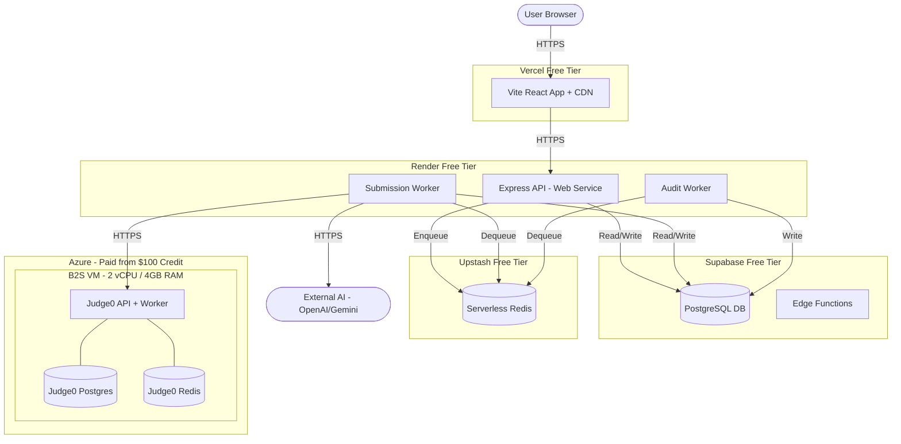

# Quiz Portal Production Deployment Architecture

This document outlines the end-to-end production architecture for the Quiz Portal, optimized for a **$0/month free-tier stack** with a dedicated paid Azure VM for Judge0 (funded by the $100 Azure credit).

## Cost Summary

| Component | Provider | Monthly Cost |
| :--- | :--- | :--- |
| Frontend | Vercel (free tier) | $0 |
| Backend API | Render (free web service) | $0 |
| Submission Worker | Render (free worker) | $0 |
| Audit Worker | Render (free worker) | $0 |
| Redis | Upstash (free tier — 500K commands/month) | $0 |
| Judge0 Sandbox | Azure B2S VM (2 vCPU / 4GB RAM) | ~$30–35 |
| Database & Auth | Supabase (free tier — 500MB DB) | $0 |
| **Total** | | **~$30–35/month** |
| **Runway on $100 credit** | | **~3 months** |

> [!IMPORTANT]
> The $100 Azure credit is spent **exclusively** on the Judge0 VM. Everything else is genuinely $0. The B2S size was chosen because Judge0's docker-compose stack (API + worker + its own Postgres + its own Redis) needs ~2–4GB to avoid OOM under concurrent submissions. The B1S (1GB) is too tight for anything beyond solo sequential testing.

> [!WARNING]
> **Known free-tier tradeoffs (non-Judge0 components):**
> - **Render cold starts:** API spins down after ~15 min idle; cold start is ~30–50s. Mitigate with a free cron ping (e.g., cron-job.org hitting `/health` every 10 min during expected demo hours).
> - **Supabase free tier pauses** after 1 week of inactivity — same cron ping strategy works.
> - **Upstash 500K commands/month** is generous for dev/portfolio but will be exceeded under sustained real classroom traffic.

## Target Architecture

### Component Breakdown

| Component | Provider | Justification |
| :--- | :--- | :--- |
| **Frontend** | Vercel (free) | Vite/React static hosting with CDN, preview deployments, and automated CI/CD from GitHub. No catches at this tier. |
| **Backend API** | Render (free web service) | Runs `node server.js` with Express & Socket.io. Single instance (no horizontal scaling on free tier). **Scalability Note:** Uses `@socket.io/redis-adapter` so if upgraded to a paid tier with multiple instances in the future, room/broadcast state is already shared via Upstash Redis. |
| **Workers** | Render (free workers) | Two separate Render services: one for `submission.worker.js`, one for `audit.worker.js`. Both consume from Upstash Redis queues. **Internal Networking:** Workers connect to the API's public Render URL via `socket.io-client` to emit real-time status updates (`BACKEND_URL` env var).    **Evaluation Split:** `submission.worker.js` handles Code Execution (Judge0 + external AI). The Supabase Edge Function `evaluate-attempt` handles MCQ scoring. No overlap. |
| **Redis** | Upstash (free — 500K cmds/month) | Serverless Redis-compatible. Works with BullMQ via `ioredis`, rate limiting via `rate-limit-redis`, and `@socket.io/redis-adapter`. TLS enforced by default on Upstash. |
| **Judge0 Sandbox** | Azure B2S VM ($30–35/month from credit) | **Security critical.** Judge0 runs untrusted user code via privileged Docker containers. The B2S (2 vCPU / 4GB RAM) provides enough headroom for Judge0's full docker-compose stack (API + worker + its own bundled Postgres + its own Redis) plus concurrent code-execution containers. **Judge0's internal Postgres and Redis stay on-VM** — they are Judge0-specific (job queue metadata, submission results) and should NOT be pointed at Supabase or Upstash. **NSG rules:** Inbound SSH from admin IP only. Port 2358 is closed to the public internet entirely. All cross-cloud traffic from Render is routed securely through an outbound-only Cloudflare Tunnel established on the VM. **Outbound egress default-deny** to prevent submitted code from reaching the internet. |
| **Database** | Supabase (free — 500MB) | Managed PostgreSQL with connection pooling and RLS. Note: Authentication (including Google/GitHub OAuth and email logins) is handled entirely in-house via the Express API using Passport and custom JWT middleware rather than using Supabase's built-in Auth service. |
| **Edge Functions** | Supabase (free) | Lightweight MCQ evaluation via `evaluate-attempt`. |

### Two Separate Redis Instances (Important Distinction)

| Redis Instance | Purpose | Location |
| :--- | :--- | :--- |
| **Upstash** | App-level: BullMQ queues, rate limiting, Socket.io adapter, token blacklisting | Cloud (Upstash free tier) |
| **Judge0's bundled Redis** | Judge0-internal: job queue for sandbox workers | On-VM (inside docker-compose) |

These are completely independent. Your app code (`config/redis.js`, `submission.queue.js`, `rateLimiter.js`) connects to Upstash. Judge0's docker-compose connects to its own containerized Redis. They never talk to each other.

### Cross-Cloud Networking: Render → Azure Judge0

This is the one connection that spans cloud providers and needs specific care:

- **Render does not provide fixed outbound IPs on the free tier.** Firewalling raw IPs in Azure NSG is therefore not feasible.
- **Enforced Networking Strategy (Cloudflare Tunnel):**
  - Run `cloudflared` on the Azure VM to establish an outbound connection to Cloudflare.
  - The Render workers call Judge0 via the secured Cloudflare-proxied hostname (e.g., `https://judge0.your-domain.com`).
  - **No inbound ports (including 2358) are opened on the Azure NSG** to the public internet, eliminating public port-scanning and brute-force risks on the sandbox.
  - Authentication headers/keys (`JUDGE0_API_KEY`) must still be passed to secure the Cloudflare endpoint routing.
